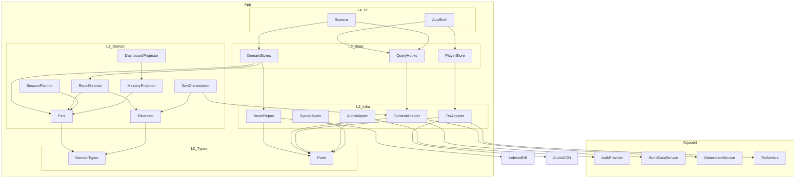
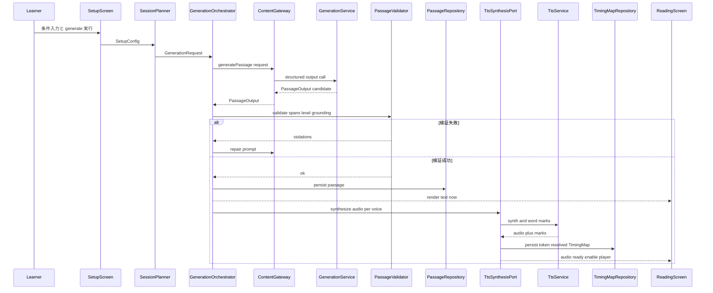
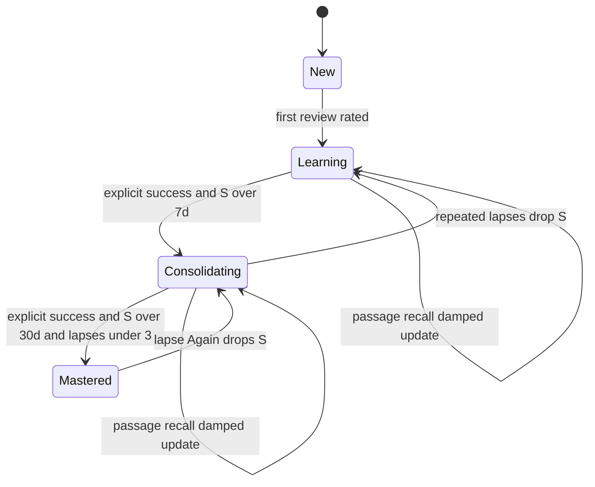
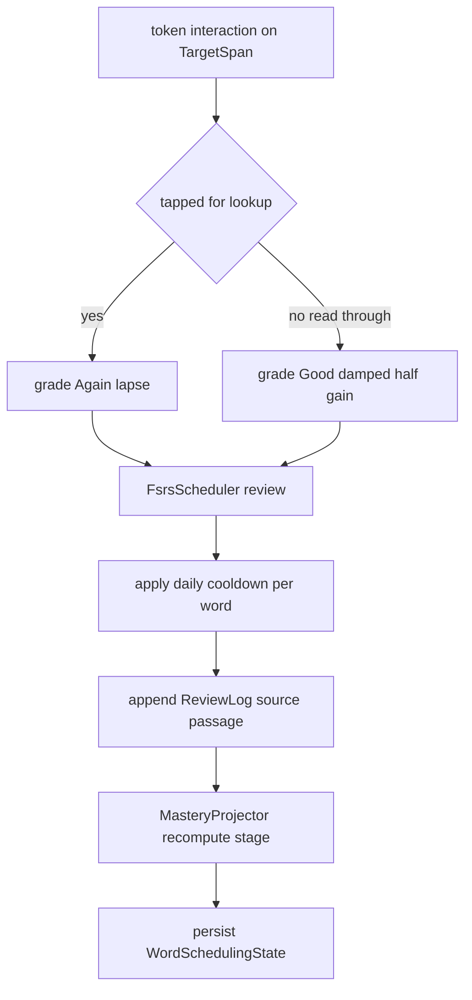

# Technical Design — english-vocabulary-learning (Lexia)

> 背景の調査ログ・比較・出典は `research.md` を参照。本書は設計判断と契約を自己完結的に記述する。要件 ID は requirements.md の数値 ID（例 `1.1`, `9.4`）をそのまま用いる。

## Overview

本機能は英単語学習 Web アプリ **「Lexia」** を提供する。Lexia は学習者の未学習・低習熟度の単語を織り込んだ「読みやすい英文（passage）」を生成し、その文脈の中で語彙を学ばせる。単語は単独の和訳ではなく、コロケーション・コノテーション・レジスター・語源・意味のネットワーク等の多面的手がかりとともに提示し、習熟度に応じて同じ語を異なる文脈で再登場させて定着させる。

**Users**: CEFR A2〜C2 の日本人英語学習者が、ダッシュボードで状況を把握し、セットアップで条件を決めて文章を生成し、読解（注釈・気づき・音声追従）と間隔反復復習で語彙を運用レベルまで定着させる。**Impact**: 既存の製品コードは無い。同梱の `support.js` はデザインキャンバスを描画する dc-runtime ビューアであり、`英単語学習サイト.dc.html` は静的ビジュアルモックである。したがって本機能は**新規のレスポンシブ SPA をグリーンフィールドで構築**し、モックの6フレームを**視覚的な実装基準**（レイアウト・配色・タイポグラフィ・余白・角丸・影・状態別注釈エンコード）とし、各画面を対応フレームに視覚的に一致させる。具体値は本書末尾「Data Models → Design Tokens」を単一情報源とする。

passage の**生成**は本仕様が所有する中核能力であり、LLM（Anthropic Claude API）を薄いサーバ/エッジプロキシ経由で利用する。一方、単語の**辞書データ**（語彙属性・発音音声・イラスト）と**学習者の識別/認証**は隣接サービスからの供給を前提とし、本機能は参照・表示する。

### Goals
- セットアップ条件（レベル・テーマ・新出比率・長さ・対象単語）から CEFR 準拠の注釈付き passage を**決定論的にレンダリングできる構造で**生成する。（1, 2, 3, 4, 5, 6）
- FSRS-6 による単語ごとの習熟度・スケジュール管理と、4段階習熟度・残り回数目安・復習体験を提供する。（1, 9）
- iOS Safari を含む全環境で、事前生成 TTS による語単位追従ハイライト・速度/声切替・シークを実現する。（7, 12）
- 学習データ（習熟度・SRS・進捗・設定）をローカルファーストで永続化し、端末紛失に備えるエクスポート/同期シームを持つ。（13）
- PC・モバイル両対応のレスポンシブ UI と下部固定プレーヤーを単一コンポーネントツリーで提供する。（12）

### Non-Goals
- アカウント登録・認証・パスワード管理・課金（隣接 AuthProvider をシーム化するのみ）。
- 単語辞書データ・音声・イラストの**生成/編集ツールや供給基盤の構築**（隣接 WordDataProvider を参照するのみ）。
- クラウドの本格的なクロスデバイス同期（SyncAdapter のシームと export/import までを所有。実同期実装は将来）。
- ソーシャル機能・講師/管理者向け管理画面。
- オフラインでの**新規生成・初回音声合成**（生成・初回 TTS は本質的にオンライン。オフラインは生成済み・合成済み・キャッシュ済み passage に限る）。

## Boundary Commitments

### This Spec Owns
- 習熟度管理（FSRS 状態と4段階習熟度の導出・永続化）。（1, 9, 13.1）
- passage 生成オーケストレーション（プロンプト組立・構造化出力呼び出し・生成→検証→修復ループ・CEFR ゲート）と**注釈レンダリングモデル**（文/トークンインデックス）。（3, 4, 5, 6）
- 音声再生オーケストレーションと追従ハイライト制御（タイミングマップのトークン解決・rAF 追従）。（7）
- 読解中の再認イベント→スケジュール反映ロジック。（1.3, 3.4, 9.5）
- 全学習状態（習熟度・SRS・復習ログ・進捗・設定・passage・タイミングマップ）のローカルファースト永続化。（13）
- レスポンシブ PC/モバイル レイアウトと下部固定プレーヤー、各画面（ダッシュボード/読解/単語詳細/復習/セットアップ/単語帳）。（4, 10, 11, 12）

### Out of Boundary
- 認証フロー・アカウント/課金・ソーシャル・管理画面。
- 単語辞書データ・発音音声・イラストの**生成元/編集**。本機能は供給データを参照するのみ。
- LLM プロバイダ自体の運用、TTS エンジン自体の構築（プロバイダはアダプタ越しに利用）。
- 本格的クラウド同期サーバの実装。

### Allowed Dependencies
- **AuthProvider（隣接）**: 学習者を識別する `userId` を供給。データ名前空間化に使用。
- **WordDataProvider（隣接）**: 単語 id をキーに語彙属性・発音音声 URL・イラスト URL を供給。
- **PassageGenerationService（隣接、LLM バックエンド）**: Claude API を保持する薄いサーバ/エッジ。クレデンシャルはクライアントに出さない。
- **TtsSynthesisService（隣接）**: Amazon Polly Neural 等。音声アセットと語マークを生成。
- **ブラウザ基盤**: IndexedDB（Dexie 経由）、HTMLAudioElement、Storage API。
- 依存制約: ドメイン層は React / Dexie / network を import してはならない（依存方向は Architecture 参照）。

### Revalidation Triggers
- ContentGateway の生成出力契約（`PassageOutput` の注釈スパンモデル・enum・provenance）の変更。
- WordData の属性スキーマ（語彙属性・`sourceAttribute` キー）の変更。
- FSRS 状態 `WordSchedulingState` の形・しきい値（定着7日/習熟30日）の変更。
- AudioAsset / TimingMap（`WordMark` の `tokenId`/時間基底）契約の変更。
- AuthProvider シーム（`userId` 取得・名前空間規約）の変更。
- `TokenizerJoinService` の結合規則・`tokenId` 体系の変更（生成・TTS・再認の3者に波及）。

## Architecture

### Existing Architecture Analysis
- 既存実行コードは無い。`support.js` は `<x-dc>` を解釈してキャンバス上にデザインドキュメントを描画する dc-runtime（React 依存のビューア）であり、**製品の依存に含めない**。
- `英単語学習サイト.dc.html` の6フレーム（Dashboard / Reading / WordCard / Review / Setup / iPhone Reading）は UI 要件・レイアウト・**デザイントークン**（配色・フォント・余白・角丸・影・状態別注釈エンコード）の確定情報源（**視覚基準**）として扱う（Data Models 末尾の Design Tokens 参照）。各画面は対応フレームに視覚的に一致させ、ビジュアル一致検証（tasks 11.4）で差分を担保する。
- `.kiro/steering/` は未作成。プロジェクト全体規約が無いため、本書で依存方向・型安全・境界を原則として明文化する。

### Architecture Pattern & Boundary Map

**採用パターン**: レイヤード＋ポート&アダプタ（ヘキサゴナル）。依存は一方向で内側（純粋ドメイン）に向かう。隣接3能力（Auth / Content / TTS）と Sync は**注入シーム**として interface 化し、UI は実装を直接 import しない。



**Architecture Integration**:
- **Selected pattern**: ヘキサゴナル。ドメイン（FSRS・トークナイザ・生成検証・習熟度射影）を純粋関数群に隔離し、隣接サービス・永続化・React を周辺アダプタに置く。
- **Dependency direction（強制）**: `L0 types → L1 domain → L2 infra → L3 state → L4 UI`。各層は左側の層のみ import 可。**ドメイン層（L1）は React/Dexie/network を import 不可**。ポート interface は L0 に定義し、L2 アダプタが実装する（内向き依存）。実装・レビューはこの違反をエラーとして扱う。
- **Domain/feature boundaries**: 4つの主要関心（スケジューリング・生成・音声・永続化）を別ドメインサービスに分離し、**`TargetSpan` と `tokenId`** を共有結合点とする。
- **New components rationale**: `TokenizerJoinService` は生成/TTS/再認の3者が同一トークン定義を共有するための単一真実源として新設（最重要シーム）。`ReviewLogRepository`（append-only）は FSRS 再生・損失復旧・二重計上クールダウンに必須として新設。
- **Steering compliance**: ステアリング不在のため、本書の依存方向・型安全・境界規約がプロジェクト原則を兼ねる。

### Technology Stack

| Layer | Choice / Version | Role in Feature | Notes |
|-------|------------------|-----------------|-------|
| Frontend (UI) | React 19.2.x + TypeScript 5.x、Vite 8.1.x | 単一レスポンシブ SPA、ビルド | Rolldown 移行リスク時は Vite 7.x にフォールバック可 |
| Routing | React Router v7（`createBrowserRouter`、SSR 無し。v8 は非破壊で移行可） | 5 ルートのクライアントルーティング | SSR/SEO 不要のためメタフレームワークは採用しない |
| Server state | TanStack Query v5.x | 隣接 Content（生成・単語データ）のキャッシュ/再試行/重複排除/SWR | 外部データを Zustand へ複製しない |
| Domain/UI state | Zustand v5.x | 学習ドメイン状態・プレーヤー状態・設定 | persist は theme/locale のみ localStorage |
| Data / Storage | Dexie 4.4.x（IndexedDB） | 学習記録の system-of-record、`useLiveQuery` で反応的読取 | 番号付きマイグレーション。音声 blob は保存しない |
| Data / Prefs | localStorage | theme/locale の同期読取（FOUC 回避） | 極小キーのみ |
| Generation (server) | 薄いプロキシ + Anthropic SDK、モデル `claude-opus-4-8`（既定）/ `claude-sonnet-4-6`（高ボリューム時） | 構造化出力で `PassageOutput` を生成 | `output_config.format` json_schema、`thinking:{type:'adaptive'}`、`effort:'high'`、streaming、Batches 50%割引で事前生成 |
| TTS (service) | Amazon Polly Neural（既定）/ Azure WordBoundary（代替） | 音声アセット＋語マーク生成 | $16/1M chars。声ごとに音声＋マップ1組 |
| Asset storage | オブジェクトストレージ + CDN/HTTP キャッシュ | 音声・イラストの配信 | URL 参照。IndexedDB には入れない |

## File Structure Plan

依存方向（`types → domain → infra → state → ui`）をディレクトリ構成で表現する。各ディレクトリは左側ディレクトリのみ import 可。

### Directory Structure
```
src/
├── types/                      # L0: 純粋ドメイン型 + ポート interface（依存なし）
│   ├── domain.ts               # Word, Passage, Token, SpanRef, TargetSpan, WordSchedulingState ...
│   ├── ports.ts                # AuthProvider, ContentGateway, TtsSynthesisPort, SyncAdapter, *Repository
│   └── result.ts               # Result<T,E> 判別共用体
├── domain/                     # L1: 純粋サービス（React/Dexie/network を import 不可）
│   ├── tokenizer/joinService.ts        # トークン↔正規文字列↔オフセット、tokenId（単一真実源）
│   ├── srs/fsrsScheduler.ts            # FSRS-6（固定重み）review/nextInterval/simulate/repsToConsolidate
│   ├── srs/masteryProjector.ts         # deriveMastery（4段階）＋ 4→3 ダウンキャスト
│   ├── srs/recallEventService.ts       # TargetSpan 操作→FSRS グレード、減衰・日次クールダウン
│   ├── session/sessionPlanner.ts       # due/低安定度 + Setup → 生成リクエスト
│   ├── generation/passageValidator.ts  # stop_reason/スパン/表層/sourceAttribute/CEFR 検証
│   ├── generation/generationOrchestrator.ts # 生成→検証→修復ループ
│   └── dashboard/dashboardProjector.ts # 内訳/ストリーク/期限リスト導出
├── infra/                      # L2: ポート実装（アダプタ）
│   ├── persistence/lexiaDb.ts          # Dexie スキーマ + version()/upgrade()
│   ├── persistence/*Repository.ts      # Scheduling/ReviewLog/Passage/TimingMap/Progress/Settings/WordCache
│   ├── content/contentGatewayHttp.ts   # 生成プロキシ + 単語データ HTTP
│   ├── tts/ttsSynthesisAdapter.ts      # Polly 呼び出し（通常はサーバ側）/ アセット取得
│   ├── auth/authAdapter.ts             # 隣接 Auth ラップ、anonymous→userId 移行
│   └── sync/exportImport.ts            # JSON export/import、SyncAdapter
├── state/                      # L3: stores + query hooks（アダプタを配線）
│   ├── stores/playerStore.ts           # 単一 <audio>、play/toggle/rate/voice
│   ├── stores/sessionStore.ts          # 進行中 passage・読解 UI 状態
│   ├── stores/settingsStore.ts         # 表示設定（persist）
│   ├── queries/contentQueries.ts       # useGeneratePassage / useWordData
│   └── hooks/useScheduling.ts          # useLiveQuery 経由の due/mastery 反応的読取
└── ui/                         # L4: React コンポーネント
    ├── AppShell.tsx                    # 常駐レイアウト + BottomPlayer（<audio> 非アンマウント）
    ├── router.tsx                      # createBrowserRouter 配線
    ├── shared/                         # TopNav, AnnotatedSpan, MasteryDot, Legend ...
    ├── reading/                        # PassageRenderer, NoticeRail, SentenceTranslation, HighlightController
    ├── wordcard/                       # WordDetailCard（Header/Core/More 折りたたみ）
    ├── review/                         # ReviewSession, ContextCard, DifficultyButtons
    ├── dashboard/                      # MasteryOverview, WeeklyActivity, ReviewDueList ...
    ├── setup/                          # LevelSelector, ThemeSelector, Sliders, TargetWordsEditor
    └── wordbook/                       # WordList, MasteryFilter, SearchBox
```

> `infra/persistence/*Repository.ts` は同一パターン（`types/ports.ts` の `*Repository` interface を Dexie で実装）。UI 配下の各画面ディレクトリも「画面コンテナ＋プレゼン部品」の同一パターンに従う。

### Modified Files
- 既存コードの改変は無い（グリーンフィールド）。`英単語学習サイト.dc.html` / `support.js` はデザイン参照として残し、`src/` からは依存しない。

## System Flows

### Flow 1: passage 生成 → 検証 → TTS → Reading-ready（段階的レディネス）
本文は検証直後に即描画し（再認・lookup 可能）、音声プレーヤーはタイミングマップ到着まで loading 表示で待つ。



### Flow 2: 単語習熟度の状態機械（4段階）
段階昇格は**明示的復習で想起成功（grade>=3）時に Stability がしきい値を越えた**場合のみ発火。読解中の再認は Stability を更新するが単独では昇格させない。



### Flow 3: 読解中の再認 → FSRS 反映


## Requirements Traceability

| Requirement | Summary | Components | Interfaces / Contracts | Flows |
|-------------|---------|------------|------------------------|-------|
| 1.1–1.5 | 習熟度4段階の保持・更新・昇格・最新反映 | FsrsScheduler, MasteryProjector, SchedulingRepository | `WordSchedulingState`, `deriveMastery` | Flow 2, 3 |
| 2.1–2.7 | セットアップ（レベル/テーマ/比率/長さ/対象語の自動選定・除外/追加・必須検証） | SetupScreen, SessionPlanner, SettingsRepository | `SetupConfig`, `SessionPlanner.plan` | Flow 1 |
| 3.1–3.6 | 文脈文章生成・複数文配置・再登場・注釈漸減・メタ | GenerationOrchestrator, PassageValidator, ContentGateway, Tokenizer | `PassageOutput`, `ContentGateway.generatePassage` | Flow 1 |
| 4.1–4.6 | 読解表示・状態別注釈・コロケーション強調・凡例・単語選択→詳細・文字サイズ | PassageRenderer, AnnotatedSpan, Legend, ReadingScreen | `TargetSpan`, `CollocationSpan`, `Settings.fontScale` | Flow 1 |
| 5.1–5.5 | 和訳モード（オフ/文ごと/全文）切替・文単位表示 | SentenceTranslation, ReadingScreen, settingsStore | `Settings.translationMode`, `Sentence.translationJa` | — |
| 6.1–6.4 | 気づき一覧（対象表現＋分類）・学習単語一覧・再登場補足 | NoticeRail, StudyWordsList, MasteryProjector | `NoticeCue`, `TargetSpan.reappearInfo` | Flow 1 |
| 7.1–7.6 | 全文朗読再生/停止・追従ハイライト・速度/声・位置/シーク・単語発音 | PlayerStore, HighlightController, TtsSynthesisPort, BottomPlayer, WordDetailCard | `AudioAsset`, `TimingMap`, `WordMark` | Flow 1 |
| 8.1–8.5 | 単語詳細カード（ヘッダ/コア/MORE 折りたたみ・欠落耐性） | WordDetailCard, ContentGateway(getWordData), WordCacheRepository | `WordData`（optional 属性） | — |
| 9.1–9.6 | 復習セッション・新文脈・解答提示・4評価＋区間・再スケジュール・残り回数 | ReviewSession, FsrsScheduler, RecallEventService, ReviewLogRepository | `Rating`, `FsrsScheduler.simulate`, `repsToConsolidate` | Flow 2, 3 |
| 10.1–10.6 | ダッシュボード（挨拶/本日数・内訳・読みかけ・週次・期限リスト・ストリーク/最近） | DashboardProjector, dashboard/* | `DashboardSnapshot` | — |
| 11.1–11.3 | 単語帳（一覧・絞り込み/検索・詳細表示） | WordbookScreen, SchedulingRepository, WordCacheRepository | `useLiveQuery` 読取 | — |
| 12.1–12.4 | レスポンシブ・固定プレーヤー・主要機能の両対応・モバイル戻る/メタ | AppShell, BottomPlayer, ReadingScreen | dvh + safe-area パターン | Flow 1 |
| 13.1–13.4 | 永続化（習熟度/スケジュール・進捗・設定・再訪復元） | LexiaDB, 全 Repository, SyncAdapter | `*Repository`, `SyncAdapter` | — |

## Components and Interfaces

| Component | Layer | Intent | Req Coverage | Key Dependencies (P0/P1) | Contracts |
|-----------|-------|--------|--------------|--------------------------|-----------|
| TokenizerJoinService | Domain | トークン↔正規文字列↔オフセット↔tokenId の単一真実源 | 3, 4, 7 | DomainTypes (P0) | Service |
| FsrsScheduler | Domain | FSRS-6 スケジューリングと区間/残り回数 | 1, 9 | DomainTypes (P0) | Service |
| MasteryProjector | Domain | FSRS 状態→4段階習熟度＋3段階ダウンキャスト | 1, 3, 6 | FsrsScheduler (P1) | Service |
| RecallEventService | Domain | 読解再認→FSRS グレード（減衰/クールダウン） | 1, 3, 9 | FsrsScheduler (P0), ReviewLogRepository (P0) | Service |
| SessionPlanner | Domain | 候補語選定＋Setup→生成リクエスト | 2, 9 | SchedulingRepository (P0) | Service |
| GenerationOrchestrator | Domain | 生成→検証→修復ループ | 3 | ContentGateway (P0), PassageValidator (P0), Tokenizer (P0) | Service |
| PassageValidator | Domain | スパン/表層/sourceAttribute/CEFR 検証 | 3 | Tokenizer (P0) | Service |
| DashboardProjector | Domain | 内訳/ストリーク/期限/最近の導出 | 10 | MasteryProjector (P1) | Service |
| AuthProvider | Port/Infra | 学習者識別→userId | 13 | 隣接 Auth (External P0) | Service |
| ContentGateway | Port/Infra | 生成・単語データ取得 | 3, 8 | 隣接 Gen/WordData (External P0) | Service, API |
| TtsSynthesisPort | Port/Infra | 音声＋語マーク生成・取得 | 7 | 隣接 TTS (External P0) | Service, Batch |
| SyncAdapter | Port/Infra | export/import・将来同期 | 13 | LexiaDB (P0) | Service |
| LexiaDB + Repositories | Persistence | 学習状態の system-of-record | 1, 9, 10, 11, 13 | IndexedDB (P0) | State |
| PlayerStore | State | 単一 audio・再生制御 | 7, 12 | TtsSynthesisPort (P0), AppShell (P0) | State |
| AppShell + Screens | UI | レスポンシブレイアウト・固定プレーヤー・各画面 | 4, 10, 11, 12 | State 層 (P0) | — |

> 以下、新たな境界を持つコンポーネントのみ詳細ブロックを示す。プレゼン部品（カード・チップ・チャート等）は上表＋Implementation Note に従う。

### Domain Layer

#### TokenizerJoinService

| Field | Detail |
|-------|--------|
| Intent | 生成・TTS マーク対応付け・再認ヒットテストが共有する唯一のトークン定義 |
| Requirements | 3.1, 4.2, 4.3, 7.2 |

**Responsibilities & Constraints**
- `PassageOutput.sentences[].tokens` を正規文字列へ結合する**決定論的な結合規則**（句読点トークン前後の空白規則）を所有する。
- 各トークンに安定 `tokenId = passageId:sentenceIndex:tokenIndex` を割り当て、UTF-16（JS 描画）と UTF-8（Polly 入力）両基底の `charStart/charEnd` を算出する。
- Polly のバイトオフセット範囲を**ちょうど1トークン**へ解決する。被覆不一致は呼び出し側で検証エラーとする。

**Dependencies**
- Inbound: GenerationOrchestrator, PassageValidator, RecallEventService, HighlightController — 同一トークン定義の利用 (P0)。
- Outbound: なし（純粋）。

**Contracts**: Service [x] / API [ ] / Event [ ] / Batch [ ] / State [ ]

##### Service Interface
```typescript
interface TokenizerJoinService {
  // tokens 配列 → 正規表示文字列（句読点間隔規則を固定）
  renderText(sentence: Sentence): string;
  // passage 全体に安定 tokenId と両基底オフセットを付与
  index(passageId: string, passage: PassageOutput): IndexedPassage;
  // Polly word mark のバイト範囲 → 一意の tokenId（解決不能なら error）
  resolveMark(idx: IndexedPassage, mark: ByteRange): Result<TokenId, TokenResolveError>;
  // 画面座標/イベント対象 → TargetSpan ヒットテスト
  hitTest(idx: IndexedPassage, tokenId: TokenId): TargetSpan | null;
}
type TokenResolveError = { kind: 'no_token' | 'multi_token'; byteRange: ByteRange };
```
- Preconditions: `passage.sentences` は非空、各 token は非空文字列。
- Postconditions: `index()` の全 token に一意 `tokenId` と両基底オフセットが付与される。
- Invariants: 同一入力に対し `renderText`/`index` は決定論的。

**Implementation Notes**
- Integration: 生成側プロンプトに結合規則（句読点・短縮形・ハイフン）を明示し、レンダラと**同一関数**を共有する。
- Validation: `resolveMark` が全マークで成功し、被覆＝トークン数であることをアセット公開前に検査。
- Risks: 文字エンコーディング不一致（曲線引用符・em ダッシュ・借用語）。正規化＋両基底算出で吸収。

#### FsrsScheduler

| Field | Detail |
|-------|--------|
| Intent | FSRS-6（固定既定重み）によるスケジューリングと UI 表示用の区間/残り回数 |
| Requirements | 1.3, 1.4, 9.4, 9.5, 9.6 |

**Responsibilities & Constraints**
- 状態は Stability `S`・Difficulty `D` のみ永続化。Retrievability `R` は経過時間から都度計算。
- 4評価（Again/Hard/Good/Easy=1..4）→ `review()` で `S'`/`D'`/`dueAt` を更新。期限は絶対経過 ms で判定（暦日でなく連続 `R(t,S)`）。
- 各ボタンの**表示間隔**は `simulate(state, rating)` の `S'` から `nextInterval` で算出（学習ステップ中の短間隔は固定ラダーで上書き）。

**Contracts**: Service [x] / State [x]

##### Service Interface
```typescript
type Rating = 1 | 2 | 3 | 4; // Again / Hard / Good / Easy

interface FsrsScheduler {
  initial(rating: Rating, now: number): WordSchedulingState;            // 初回評価
  review(state: WordSchedulingState, rating: Rating, now: number): WordSchedulingState;
  simulate(state: WordSchedulingState, rating: Rating, now: number): WordSchedulingState; // 非破壊
  retrievability(state: WordSchedulingState, now: number): number;       // R in [0,1]
  nextIntervalMs(state: WordSchedulingState): number;                    // 表示用
  repsToConsolidate(state: WordSchedulingState): number;                 // 「あと N 回」
}
```
- Preconditions: `now` は単調増加の epoch ms。`state.stability>0`（New は `stability` 未設定）。
- Postconditions: `review()` は `dueAt = now + nextIntervalMs(result)` を満たす。
- Invariants: 既定重み `w[0..20]` は不変定数（`research.md` の配列）。`Rd=0.90`。

**Implementation Notes**
- Integration: 既定重み・`S_CONSOLIDATE=7`・`S_MASTER=30`・初回表示ラダー（Again 10分 / Hard 1日 / Good 4日 / Easy 10日）を1つの設定モジュールに集約。
- Validation: 純粋関数として既知入力→既知出力のユニットテスト（区間・残り回数）。
- Risks: 既定 S0 とモック表示の差。初回ラダー上書きで吸収し、二経路をコメント明記。

#### RecallEventService

| Field | Detail |
|-------|--------|
| Intent | 読解中の TargetSpan 操作を FSRS グレードへ写像し、減衰・クールダウンを適用してログ化 |
| Requirements | 1.3, 3.4, 9.5 |

**Responsibilities & Constraints**
- タップ（lookup）= Again(1) lapse、タップ無し読了 = **減衰 Good**（`S' = S + 0.5·(S_good − S)`）。
- 同一語の passage 由来更新には**日次クールダウン**を課し、同日復習との二重計上を防ぐ。
- passage 由来イベントは段階昇格を発火しない（昇格は明示的復習の成功のみ）。
- すべての再認は append-only `ReviewLog` に `source='passage'` で記録。

**Contracts**: Service [x] / Event [x]

##### Service Interface
```typescript
type RecallSignal =
  | { kind: 'lookup'; wordId: string; at: number }
  | { kind: 'read_through'; wordId: string; at: number };

interface RecallEventService {
  apply(
    state: WordSchedulingState,
    signal: RecallSignal,
    log: ReviewLogReader
  ): { next: WordSchedulingState; logEntry: ReviewLogEntry | null }; // クールダウン内は logEntry=null
}
```
- Preconditions: `signal.wordId` は学習対象として既知。
- Postconditions: クールダウン外なら `next.stability` が更新され `logEntry` が生成される。
- Invariants: `mastery` 段階は本サービスからは昇格しない（降格は lapse による S 低下経由で `MasteryProjector` が判定）。

**Implementation Notes**
- Integration: ReadingScreen のトークンイベント → `RecallEventService.apply` → SchedulingRepository/ReviewLogRepository。
- Validation: 減衰係数・クールダウン窓は設定定数化し、実データで検証（未検証定数）。
- Risks: 受動再認の過大評価。減衰＋非昇格＋クールダウンで緩和。

#### GenerationOrchestrator / PassageValidator

| Field | Detail |
|-------|--------|
| Intent | 構造化生成を呼び、生成→検証→修復で UI に渡せる `PassageOutput` を確定 |
| Requirements | 3.1, 3.2, 3.3, 3.5, 3.6 |

**Responsibilities & Constraints**
- `ContentGateway.generatePassage` を呼び、`stop_reason` を確認。`refusal`/`max_tokens` は再生成。
- スパン範囲（`0<=tokenStart<tokenEnd<=len`）、TargetSpan の表層が対象語の活用形か、NoticeCue の `sourceAttribute` が供給属性に存在し category と整合するか、を検証。
- CEFR 語彙プロファイル（帯域外トークン比率・新出比率）を検査し、逸脱時は修復プロンプト or 降格再生成。

**Contracts**: Service [x]

##### Service Interface
```typescript
interface GenerationOrchestrator {
  generate(req: GenerationRequest): Promise<Result<IndexedPassage, GenerationError>>;
}
interface PassageValidator {
  validate(candidate: PassageOutput, ctx: ValidationContext): ValidationReport;
}
type GenerationError =
  | { kind: 'refusal' }
  | { kind: 'max_tokens' }
  | { kind: 'validation_exhausted'; lastReport: ValidationReport };
interface ValidationReport { ok: boolean; violations: SpanViolation[]; cefrOffBandRatio: number; }
```
- Preconditions: `req` の対象語は WordData 属性が供給済み（cue 接地のため）。
- Postconditions: 成功時は全スパンが範囲内・接地済み・帯域内の `IndexedPassage`。
- Invariants: 検証は生成結果のみで完結し、外部状態を変更しない。

**Implementation Notes**
- Integration: 検証通過後にのみ PassageRepository へ永続化し、TtsSynthesisPort へ合成依頼（Flow 1）。
- Validation: スキーマは形のみ保証。本サービスの検証が load-bearing。
- Risks: レベルドリフト・ハルシネーション。プロファイルゲート＋`sourceAttribute` 検証で緩和。

### Ports / Infrastructure Layer

#### ContentGateway（生成・単語データ）

**Contracts**: Service [x] / API [x]

##### Service Interface
```typescript
interface ContentGateway {
  generatePassage(req: GenerationRequest): Promise<GenerationResponse>; // stop_reason 同梱
  getWordData(wordId: string): Promise<WordData>;                       // 隣接 WordData 供給
}
```

##### API Contract（隣接生成プロキシ）
| Method | Endpoint | Request | Response | Errors |
|--------|----------|---------|----------|--------|
| POST | /api/passages:generate | GenerationRequest | { passage: PassageOutput, stop_reason } | 400, 422(validation), 429, 503 |
| GET | /api/words/{wordId} | — | WordData | 404, 503 |

**Implementation Notes**
- Integration: サーバ側で `messages.create(output_config.format=json_schema, thinking=adaptive, effort=high, stream)`。非対話の事前生成は Batches（50%割引、結果は custom_id でキー付け）。
- Validation: クライアントは `stop_reason` と `GenerationOrchestrator` 検証を必ず通す。
- Risks: クレデンシャルはサーバ保持（クライアント露出禁止）。レイテンシは段階的レディネスで吸収。

#### TtsSynthesisPort

**Contracts**: Service [x] / Batch [x]

##### Service Interface
```typescript
interface TtsSynthesisPort {
  // 生成時：passage×voice の音声と語マークを合成し、token 解決済み TimingMap を返す
  synthesize(passage: IndexedPassage, voiceId: string): Promise<{ asset: AudioAsset; timing: TimingMap }>;
  // 単語発音（隣接 WordData 供給 or 事前生成クリップ）
  wordClipUrl(wordId: string, voiceId: string): Promise<string>;
}
```

##### Batch / Job Contract
- Trigger: passage 確定時（既定声）＋未生成声の初回要求時（遅延生成）。
- Input / validation: 正規 passage 文字列。公開前に「マーク被覆＝トークン数」を検証。
- Output / destination: 音声は CDN URL、`TimingMap` は TimingMapRepository（小 JSON）。
- Idempotency & recovery: キーは `(passageId, voiceId)`。再合成は冪等に上書き。

**Implementation Notes**
- Integration: HighlightController は `TimingMap.marks` を `tokenId` で二分探索（再トークナイズ無し）。
- Risks: バイト/UTF-16 差異・特殊文字オフセットバグ。Tokenizer 両基底＋被覆検証で防止。

#### LexiaDB + Repositories（永続化）

**Contracts**: State [x]

##### State Management
- State model: `userId` 名前空間で6+ドメインを保持（下記 Physical Data Model）。
- Persistence & consistency: Dexie `version(n).stores().upgrade()` の番号付きマイグレーション。`APP_SCHEMA_VERSION` を settings に保持し Dexie version と同期。
- Concurrency strategy: 単一ユーザ/端末。`useLiveQuery` で反応的読取。書込は repository 経由のみ。

##### Repository Interfaces（抜粋）
```typescript
interface SchedulingRepository {
  get(userId: UserId, wordId: string): Promise<WordSchedulingState | undefined>;
  upsert(state: WordSchedulingState): Promise<void>;
  dueBefore(userId: UserId, at: number): Promise<WordSchedulingState[]>;       // 「本日復習」
  lowStability(userId: UserId, limit: number): Promise<WordSchedulingState[]>; // 候補選定
}
interface ReviewLogRepository {           // append-only（FSRS 再生・損失復旧・二重計上判定）
  append(entry: ReviewLogEntry): Promise<void>;
  since(userId: UserId, from: number): Promise<ReviewLogEntry[]>;
  lastPassageUpdate(userId: UserId, wordId: string): Promise<number | undefined>;
}
// PassageRepository / TimingMapRepository / ProgressRepository / SettingsRepository / WordCacheRepository も同型
```

**Implementation Notes**
- Integration: 非同期ハイドレーション競合に注意。画面はハイドレーションフラグでゲートしスケルトン表示。
- Validation: マイグレーションはフィクスチャでユニットテスト。アップグレード前に export スナップショット。
- Risks: IndexedDB 退避（iOS）。`navigator.storage.persist()` 要求。音声 blob は保存せず URL 参照。

### State Layer

#### PlayerStore + HighlightController

| Field | Detail |
|-------|--------|
| Intent | 画面遷移をまたいで存続する単一 `<audio>` の再生制御と語追従ハイライト |
| Requirements | 7.1–7.6, 12.2, 12.3 |

**Responsibilities & Constraints**
- `<audio>` は AppShell（ルーター外）に1つだけ常駐させ、最初のユーザージェスチャで解錠後は `.src` のみ差し替える（要素を作り直さない）。
- HighlightController は rAF で `audio.currentTime*1000` を読み、アクティブ `TimingMap` を `tokenId` で二分探索してハイライト span をトグル。シーク/声切替で再計算。
- 速度は `playbackRate`、`preservesPitch`/`webkitPreservesPitch` を設定。位置/全体長/進捗は `timeupdate` で更新。

**Contracts**: State [x]

```typescript
interface PlayerStore {
  playing: boolean; rate: number; voiceId: string; currentTokenId: TokenId | null;
  load(asset: AudioAsset, timing: TimingMap): void;  // src 差し替え（要素は不変）
  toggle(): void; seekTo(ratio: number): void; setRate(rate: number): void; setVoice(voiceId: string): void;
  playWord(url: string): void;                        // 単語カード発音（ジェスチャ内）
}
```

**Implementation Notes**
- Integration: 再生/発音の `play()` は必ずタップハンドラ内（iOS 自動再生制約）。
- Risks: iOS 解錠の取り扱い。要素再生成を避け、PlayerStore のライフサイクルを AppShell に束縛。

### UI Layer（プレゼン部品は要約）

すべての画面は単一レスポンシブツリー（CSS コンテナクエリ/ブレークポイントでレイアウト切替、ルートは切り替えない）。共有 props は基底 interface を継承して差分のみ定義する。

```typescript
interface BaseScreenProps { userId: UserId; }
// 例: ReadingScreenProps extends BaseScreenProps { passageId: string }
```

- **AppShell**（12.1–12.4）: ヘッダ＋`<Outlet/>`＋常駐 `BottomPlayer`。`100dvh`＋`env(safe-area-inset-bottom)`、本文側にプレーヤー高さ分の下パディング。`viewport-fit=cover`。
- **ReadingScreen**（4, 5, 6）: `PassageRenderer`（`AnnotatedSpan` を状態別エンコードで描画）＋`SentenceTranslation`（モード別）＋`NoticeRail`＋`Legend`。`AnnotatedSpan` は `TargetSpan`/`CollocationSpan` をデザイントークンに従い装飾し、タップで `RecallEventService` と WordDetailCard を駆動。
- **WordDetailCard**（8）: Header（見出し語/IPA/発音/POS/レジスター/コノテーション/頻度/習熟度）＋常時展開 Core（意味/例文/コロケーション/ニュアンス/イラスト）＋折りたたみ MORE（語源/意味のネットワーク/語のファミリー/イディオム/文法/メタファー/誤用）。**欠落属性は破綻なくスキップ**（8.5）。
- **ReviewSession**（9）: `ContextCard`（新文脈例文＋対象語）→ 解答提示 → `MasteryProgressDots` → `DifficultyButtons`（各ボタンに `FsrsScheduler.simulate` の区間表示）。
- **SetupScreen**（2）: `LevelSelector`/`ThemeSelector`/`Sliders`（新出比率・長さ）/`TargetWordsEditor`（`SessionPlanner` の自動選定＋除外/追加）。必須未充足（レベル・対象語1語以上）は生成不可＋不足通知（2.7）。
- **DashboardScreen**（10）: `DashboardProjector` の `DashboardSnapshot` を描画（挨拶/本日数・内訳バー・読みかけ・週次・期限リスト・ストリーク/最近）。
- **WordbookScreen**（11）: `useLiveQuery` で一覧＋習熟度フィルタ＋検索、選択で WordDetailCard。

## Data Models

### Domain Model
- **集約境界**: 単語スケジューリング集約（`WordSchedulingState` + `ReviewLogEntry`、ルート=`{userId,wordId}`）、passage 集約（`PassageOutput` + `TimingMap`、ルート=`passageId`）、設定/進捗集約（`userId`）。
- **不変条件**: 習熟度段階は `WordSchedulingState` から `deriveMastery` で**導出**され独立値を持たない。段階昇格は明示的復習の成功時のみ。`ReviewLog` は append-only。
- **ドメインイベント**: `ReviewRated`（明示評価）、`PassageRecalled`（読解再認）、`PassageGenerated`、`AudioSynthesized`。

### Logical Data Model（主要型）
```typescript
type UserId = string & { readonly __brand: 'UserId' };
type TokenId = string;                 // passageId:sentenceIndex:tokenIndex
type Cefr = 'A2' | 'B1' | 'B2' | 'C1' | 'C2';
type MasteryStage = 'New' | 'Learning' | 'Consolidating' | 'Mastered';
type MasteryDensity = 'new' | 'review' | 'known'; // 生成注釈密度用（4→3 ダウンキャスト）

interface WordSchedulingState {
  userId: UserId; wordId: string;
  stability?: number;            // S(日)。未設定=New(未学習)
  difficulty: number;            // D 1..10
  reps: number; lapses: number; learningStep: number;
  lastReviewAt: number; dueAt: number;
  lastSource: 'review' | 'passage';
  mastery: MasteryStage;         // 導出値を非正規化保持
  reappearCount: number;         // 再登場回数（6.4）
}
interface ReviewLogEntry {       // append-only
  userId: UserId; wordId: string; rating: Rating;
  source: 'review' | 'passage'; at: number;
  stabilityAfter?: number;
}

// passage（生成出力。char offset は持たない）
interface PassageOutput {
  meta: { title: string; theme: string; level: Cefr; newCount: number; reviewCount: number; approxWords: number };
  sentences: Sentence[];
  targetSpans: TargetSpan[];
  collocationSpans: CollocationSpan[];
  noticeCues: NoticeCue[];
}
interface Sentence { tokens: string[]; translationJa: string; }
interface SpanRef { sentenceIndex: number; tokenStart: number; tokenEnd: number } // [start,end)
interface TargetSpan extends SpanRef { wordId: string; surface: string; masteryDensity: MasteryDensity }
interface CollocationSpan extends SpanRef { headWordId: string; collocationId: string }
type NoticeCategory =
  | 'connotation' | 'collocation' | 'register' | 'etymology' | 'semantic_network'
  | 'synonym_nuance' | 'grammar_pattern' | 'word_family' | 'frequency' | 'common_error';
interface NoticeCue { index: number; span: SpanRef; category: NoticeCategory; wordId: string; sourceAttribute: string; explanationJa: string }

// 音声タイミング
interface AudioAsset { passageId: string; voiceId: string; audioUrl: string; format: 'audio/mpeg' | 'audio/aac'; durationMs: number; engine: 'polly' | 'azure' }
interface WordMark { tokenId: TokenId; startMs: number; endMs: number }
interface TimingMap { passageId: string; voiceId: string; marks: WordMark[] }

// 外部供給（参照のみ。MORE 属性は optional＝欠落耐性）
interface WordData {
  wordId: string; headword: string; ipa: string; pos: string[];
  register: string; connotation: string; frequency: number; // 1..5
  audioUrl?: string; illustrationUrl?: string;
  core: { meaningsJa: string[]; examples: { en: string; ja: string }[]; collocations: string[]; synonymNuances: string[] };
  more?: Partial<{
    etymology: { prefix?: string; root?: string; suffix?: string };
    semanticNetwork: { synonyms: string[]; antonyms: string[]; hypernyms: string[]; hyponyms: string[]; related: string[] };
    wordFamily: string[]; idioms: string[]; grammarPatterns: string[]; metaphor: string; commonErrors: string[];
  }>;
}

// 進捗・設定
interface ReadingProgress { userId: UserId; passageId: string; sentenceIndex: number; percent: number; status: 'in_progress' | 'completed'; startedAt: number; completedAt?: number }
interface Settings { userId: UserId; translationMode: 'off' | 'per_sentence' | 'full'; fontScale: number; voiceId: string; rate: number; theme: 'light' | 'dark' | 'system'; locale: string; lastSetup: SetupConfig }
interface SetupConfig { level: Cefr; themes: string[]; newWordRatio: number; length: 'short' | 'medium' | 'long'; targetWordIds: string[]; excludedWordIds: string[] }
```

### Physical Data Model（Dexie / IndexedDB）
DB 名は `lexia_<userId>`（サインイン前は `anonymous`、初回サインインで移行）。`[userId+...]` 複合主キー。

| Store | Primary key | Indexes | Holds | Req |
|-------|-------------|---------|-------|-----|
| scheduling | `[userId+wordId]` | `userId`, `dueAt`, `stability`, `mastery` | `WordSchedulingState` | 1, 9, 11 |
| reviewLog（append-only） | 自動採番 | `[userId+wordId]`, `at` | `ReviewLogEntry` | 1, 9, 13 |
| passages | `passageId` | `userId`, `meta.theme`, `createdAt` | `PassageOutput`（正規化保存） | 3, 10 |
| timingMaps | `[passageId+voiceId]` | `passageId` | `TimingMap`（小 JSON） | 7 |
| progress | `[userId+passageId]` | `userId`, `status`, `completedAt` | `ReadingProgress` | 10, 13 |
| settings | `userId` | — | `Settings`（+APP_SCHEMA_VERSION） | 5, 13 |
| wordCache | `[userId+wordId]` | `userId` | `WordData`（TanStack Query 補完用の任意キャッシュ） | 8, 11 |

- 音声 blob・イラストは保存しない（外部 URL を HTTP/Query キャッシュ）。
- `navigator.storage.persist()` で退避抑止を要求。

### Data Contracts & Integration
- **生成 API**: `output_config.format`（`type:'json_schema'`、`additionalProperties:false`、`category` は enum）。数値/長さ制約はスキーマで表現不能なため**アプリ側検証**で担保（`PassageValidator`）。`stop_reason` を必ず確認。
- **Provenance（境界）**: 生成= passage 本文/文分割/トークン/文ごと和訳/スパン位置/cue 選択と説明/メタ。外部= 語彙属性/音声/イラスト/`sourceAttribute`/CEFR 帯域語彙、および `userId`。習熟度は**ローカル**所有（Claude 呼び出しに対しては外部入力としてプロンプト注入されるが、隣接サービスではない）。
- **エクスポート/同期**: `SyncAdapter.export(userId): Blob`（scheduling + reviewLog + progress + settings の JSON）、`import(userId, Blob)`。実クラウド同期は将来。

### Design Tokens（モック由来・視覚基準）

> 本節は `英単語学習サイト.dc.html`（6フレーム）のインラインスタイルから機械抽出した確定値であり、**UI 実装とビジュアル一致検証（tasks 11.4）の単一情報源**である。各画面は対応フレームに視覚的に一致させる。色・サイズはここに定義したトークンのみを用い、新規色/サイズの導入は本節更新を伴う。値の後の括弧はモック内の出現回数（おおよその使用頻度）。

#### カラーパレット

**ブランド / プライマリ**

| Token | 値 | 用途 |
|-------|----|------|
| `--primary` | `#3D6CB0` | 主要 CTA・アクティブナビ下線・リンク・ブランドドット・進捗/スライダ |
| `--primary-deep` | `#2D518C` | 青系チップ上の文字・強アクセント（選択中レベル等） |
| `--primary-soft` | `#7C9BC4` | プライマリ上の補助テキスト/サブ値 |
| `--primary-border` | `#CBD8E8` | 青系コンポーネントのボーダー |
| `--primary-border-2` | `#DCE6F2` | 青系の淡いボーダー |

**インク / テキスト**

| Token | 値 | 用途 |
|-------|----|------|
| `--ink` | `#1E2630` | 見出し・ブランド・主要テキスト |
| `--body` | `#27313D` | 本文（passage / 例文） |
| `--ink-soft` | `#5A6675` | 二次テキスト・ラベル |
| `--muted` | `#717E8C` | 補助テキスト |
| `--faint` | `#9AA4B1` | プレースホルダ・キャプション・非アクティブナビ |
| `--faint-2` | `#8A95A3` | 画像キャプション・和訳ブロック文字 |
| `--fainter` | `#B6BFC9` / `#B5BFCB` | 極薄テキスト・＋アイコン |

**習熟度（4段階・最重要セマンティック）**

| Stage | Token | 値 |
|-------|-------|----|
| 未学習 New | `--mastery-new` | `#C4CCD6` |
| 学習中 Learning | `--mastery-learning` | `#8FB0DA` |
| 定着 Consolidating | `--mastery-consolidating` | `#4C7BC0` |
| 習熟 Mastered | `--mastery-mastered` | `#4C9A86` |
| 非アクティブドット | `--dot-inactive` | `#CBD3DD` / `#D3DAE3` |

**アクセント**

| Token | 値 | 用途 |
|-------|----|------|
| `--green` | `#4C9A86` | ストリーク・簡単(Easy)・習熟・コノテーション番号 |
| `--green-deep` | `#3E8C79` | 緑チップ上文字 |
| `--green-bg` | `#E6F2EE` | 緑ソフト背景 |
| `--green-border` | `#BFDFD5` | 緑ソフトボーダー |
| `--terracotta` | `#C07A63` | 復習期限・もう一度(Again)・誤用注意 |
| `--terracotta-soft` | `#B6886F` | テラコッタ上の補助文字 |
| `--terracotta-border` | `#E4D2CC` | テラコッタソフトボーダー |
| `--register` | `#6B7686` | レジスター系番号/バッジ |

**サーフェス / 背景**

| Token | 値 | 用途 |
|-------|----|------|
| `--surface-page` | `#F6F8FA` | ページ/キャンバス背景 |
| `--surface-card` | `#FFFFFF` | カード面 |
| `--surface-subtle` | `#F4F7FA` / `#F1F4F8` / `#EDF1F6` | 淡い塗り（チップ/トグル） |
| `--surface-blue` | `#EEF3FA` / `#EAF0F8` | 青ティント塗り（淡ボタン/カテゴリチップ） |
| `--surface-collocation` | `#E4EDF8` | コロケーション・インライン強調 |
| `--highlight` | `#DCE8F6` | テキスト選択・復習正解ターゲット・TTS 現在語 |
| `--avatar-bg` | `#D8E0EA` | アバター丸背景 |
| `--shell-dark` | `#10151C` | iPhone 筐体/ノッチ/ホームインジケータ |

**ボーダー / 区切り**

| Token | 値 | 用途 |
|-------|----|------|
| `--border-card` | `#E8ECF2` | カード境界 |
| `--border-control` | `#E4E8EE` | 入力/コントロール境界・リスニングバー |
| `--divider-section` | `#EEF1F5` | ヘッダ/セクション区切り |
| `--divider-row` | `#F0F2F5` | リスト行区切り |
| `--track` | `#EEF1F5` / `#EAEDF1` | 進捗/シークのトラック地 |

**週次アクティビティ棒グラフ**: 通常日 `#DCE6F2`（低）/ `#A9C2E2`（中）、当日/最大 `#3D6CB0`、ほぼ無活動 `#EBEEF2`。

#### タイポグラフィ

**フォントファミリー**

| Token | スタック | 用途 |
|-------|---------|------|
| `--font-ui` | `'IBM Plex Sans','Noto Sans JP',sans-serif` | UI・日本語 UI テキスト（最多） |
| `--font-num` | `'IBM Plex Sans',sans-serif` | 数値・ラテン専用ラベル |
| `--font-serif` | `'Newsreader',serif` | 英単語・英語見出し |
| `--font-serif-jp` | `'Newsreader','Noto Serif JP',serif` | 物語タイトル/画面 H1（英＋和セリフ） |
| `--font-body-jp` | `'Noto Sans JP','IBM Plex Sans',sans-serif` | 和訳・日本語説明文 |
| `--font-mono` | `'IBM Plex Sans',monospace` | プレースホルダ/キャプション等幅 |

Google Fonts（helmet 由来）: Newsreader（opsz 6..72 / 400,500,600 / italic 400,500）, IBM Plex Sans（400,500,600,700）, Noto Sans JP（400,500,700）, Noto Serif JP（400,500,600）。

- **タイプスケール（px）**: 9 / 10 / 10.5 / 11 / 11.5 / 12 / 12.5 / 13 / 14 / 15 / 16 / 18 / 19 / 20 / 21 / 23 / 26 / 27 / 34 / 42
- **ウェイト**: 400 / 500 / 600 / 700
- **字間**: 本文 .003em、見出し .005–.01em、ラベル(uppercase) .03–.06em、★レーティング 2px

**主要ロール（フレーム実測）**

| ロール | フォント | サイズ/ウェイト | 備考 |
|-------|---------|---------------|------|
| ブランドロゴ Lexia. | serif | 23 / 600 | 末尾ドットは `--primary` |
| 画面 H1（挨拶/学習をはじめる） | serif-jp | 27 / 500 | |
| 物語タイトル H1 | serif-jp | 34 / 600 | line-height 1.25 |
| 単語見出し（WordCard） | serif | 42 / 600 | |
| passage 本文 | serif-jp | 19 / lh1.95（PC）, 18 / lh1.9（モバイル） | color `--body` |
| 和訳ブロック | body-jp | 14 / lh1.75 | color `--faint-2`、左 2px `#CBD8E8` |
| セクション見出し | ui | 14 / 600 | color `--ink` |
| ラベル/キャプション | ui | 11–13 | color `--muted` / `--faint` |

#### 角丸・影・スペーシング

**角丸**

| Token | 値 | 用途 |
|-------|----|------|
| `--radius-card` | 8px | カード |
| `--radius-control` | 6–7px | ボタン/トグル群 |
| `--radius-chip` | 5–6px | チップ/バッジ（テーマピル 18px、モバイルトグル 17px、丸バッジ 10px） |
| `--radius-track` | 3px | 進捗/シークトラック |
| `--radius-full` | 50% | ドット/アバター/丸ボタン |
| phone | 56(筐体)/44(画面)/22(プレーヤー上端)/16(ノッチ) px | iPhone フレーム |

**影**

| Token | 値 |
|-------|----|
| `--shadow-card` | `0 6px 32px rgba(25,40,65,.10), 0 1px 3px rgba(25,40,65,.06)` |
| `--shadow-play` | `0 2px 8px rgba(61,108,176,.3)`（PC）/ `0 3px 10px rgba(61,108,176,.32)`（モバイル） |
| `--shadow-phone` | `0 24px 70px rgba(25,40,65,.28)` |
| `--shadow-dock` | `0 -6px 24px rgba(25,40,65,.07)` |
| `--shadow-thumb` | `0 1px 3px rgba(0,0,0,.15)` / シーク `.18` |

**レイアウト幅 / スペーシング**

- フレーム幅: Dashboard/Reading 1180px、WordCard 780px、Setup/Review 880px、reading 本文 max 600px。
- iPhone: デバイス 414px、画面 388×842px、`100dvh` + `env(safe-area-inset-bottom)` + `viewport-fit=cover`。
- カードヘッダ padding 16px 28px、本文 padding 22–40px。
- ギャップスケール: 6 / 7 / 8 / 10 / 11 / 14 / 16 / 18 / 22 / 24 / 26 / 28 / 32 / 34 px。
- バー高さ: 習熟度バー 10px、進捗 6px、リスニングトラック 5px。ボーダー基本 1px、アクティブ強調 1.5–2px。

#### 状態別注釈エンコード（passage 内・最重要）

`MasteryDensity`（4→3 ダウンキャスト）と注釈種別を視覚にマップする。`AnnotatedSpan` はこの表に厳密準拠する。

| 注釈 | 視覚エンコード | 色 |
|------|--------------|----|
| 新出（new） | 下線 solid 1.5–2px | `--mastery-consolidating` `#4C7BC0` |
| 学習中（review/learning） | 下線 solid 1.5–2px | `--mastery-learning` `#8FB0DA` |
| 定着・再登場（known） | 下線 dotted 1.5–2px | `--mastery-new` `#C4CCD6` |
| 初出強調（brand-new キーワード） | 塗りチップ・白文字 | bg `--primary` `#3D6CB0` |
| コロケーション | 角丸チップ塗り（`box-decoration-break:clone`） | bg `--surface-collocation` `#E4EDF8` |
| 気づき番号（丸数字） | 円・白数字 | コノテーション `#4C9A86` / コロケーション・文法 `#3D6CB0` / レジスター `#6B7686` |
| 復習正解ターゲット（Review） | bg ＋ 下線 2px | bg `--highlight` `#DCE8F6` / 下線 `--primary` |
| TTS 現在語 | serif italic + primary 文字（追従ハイライト時に強調） | `--primary` |

**気づきカテゴリチップ（NoticeRail）**

| カテゴリ | 文字色 | 背景 |
|---------|-------|------|
| コノテーション | `#3E8C79` | `#E6F2EE` |
| コロケーション | `#2D518C` | `#EAF0F8` |
| レジスター | `#5A6675` | `#EDF1F6` |

**習熟度ドット（一覧/チップ）**: 円 7–9px、色は習熟度4トークン（学習中 `#8FB0DA` / 定着 `#4C7BC0` / 習熟 `#4C9A86`）。

## Error Handling

### Error Strategy
すべての境界（生成・TTS・永続化・隣接取得）は `Result<T,E>` 判別共用体で失敗を表現し、ドメインは例外を投げない。隣接 I/O のみ Promise 拒否を許容し、State 層で `Result` に正規化する。

### Error Categories and Responses
- **User Errors**: セットアップ必須未充足（レベル/対象語0）→ 生成を実行せず不足項目をフィールド単位で通知（2.7）。
- **Generation Errors**: `stop_reason=refusal/max_tokens` → 自動再生成（上限回数）。検証逸脱（スパン/接地/CEFR）→ 修復プロンプト→上限で `validation_exhausted` をユーザに通知し別条件を促す。
- **TTS Errors**: 合成/被覆検証失敗 → 本文は読める状態を維持し、プレーヤーを「音声準備中/利用不可」に degrade（追従ハイライトのみ無効、再認・読解は継続）。
- **Persistence Errors**: IndexedDB 書込失敗/退避 → 直近操作を再試行＋バナー警告、export 促し。マイグレーション失敗 → アップグレード前スナップショットへロールバック手順を提示。
- **Hydration**: ストア未ハイドレーション中は復習キュー等を計算せずスケルトン表示。

### Monitoring
- 生成の `stop_reason`・検証違反種別・CEFR 帯域外比率・修復回数をクライアントイベントとして記録（学習用テレメトリ）。
- TTS マーク被覆率・解決失敗、IndexedDB 退避イベント、ハイドレーション所要を計測。
- 未検証定数（減衰0.5・閾値7/30・帯域許容）は計測対象として明示し、実データで再調整。

## Testing Strategy

### Unit Tests
- `FsrsScheduler`: 既知入力→区間・残り回数・段階導出（境界 S=7/30）。初回ラダー上書きとの整合。
- `TokenizerJoinService`: 句読点/短縮形/ハイフンの結合規則、両基底オフセット、Polly バイト範囲→一意 tokenId、特殊文字での被覆検証。
- `PassageValidator`: スパン範囲外/表層不一致/未接地 cue/帯域逸脱の検出と修復トリガ。
- `MasteryProjector` / `RecallEventService`: 4→3 ダウンキャスト、減衰更新、日次クールダウンによる二重計上抑止。

### Integration Tests
- 生成→検証→修復→永続化→TTS→Reading-ready パイプライン（Flow 1、段階的レディネス：本文先行・音声非同期）。
- 復習評価→FSRS 再スケジュール→`ReviewLog` 追記→習熟度再射影→ダッシュボード反映（Flow 2/3）。
- Dexie マイグレーション（seed フィクスチャ→version 上げ→不変条件保持）と `anonymous→userId` 移行。

### E2E / UI Tests
- 読解：状態別注釈表示・凡例・単語選択→詳細・文字サイズ・和訳モード切替（4, 5, 6）。
- 音声追従：再生/シーク/速度/声切替でハイライトが正トークンに追従（iOS Safari 実機含む、7, 12）。
- セットアップ→生成→読解→復習の主要導線、PC/モバイルレイアウトと固定プレーヤー（2, 12）。

### Performance / Reliability
- 生成＋TTS のレイテンシ積み上げ計測と段階的レディネスの体感確認。Batches 事前生成の効果。
- 大量語彙での `dueBefore`/`lowStability` クエリ（インデックス効作）と `useLiveQuery` 再描画コスト。
- IndexedDB 退避/復元（export→import ラウンドトリップでの SRS/ログ完全性）。

## Security Considerations
- **クレデンシャル分離**: LLM/TTS の API キーは隣接サーバ/プロキシ保持。クライアントへ露出させない（生成・初回合成はサーバ側）。
- **学習データ**: ローカル保持（PII 最小）。`userId` 名前空間で分離。export データはユーザ操作でのみ生成・取り出し。
- **入力健全化**: 生成テキストの特殊文字を正規化し、TTS オフセット破壊（`< > &`）を回避。スキーマ enum と検証で不正注釈を遮断。

## Performance & Scalability
- **ターゲット**: 本文レンダリングは生成検証直後に即時（音声は非同期到着）。追従ハイライトは rAF＋二分探索で O(log n)。
- **コスト最適化**: プロンプトキャッシュ（安定プレフィックス＋セッション単語データに `cache_control: ephemeral`）、非対話生成は Batches（50%割引）、高ボリュームは `claude-sonnet-4-6`。
- **スケール**: 単一ユーザ/端末のため水平スケールは隣接生成/TTS 側の関心。クライアントは IndexedDB インデックス設計（`dueAt`/`stability`）でクエリを抑制。
